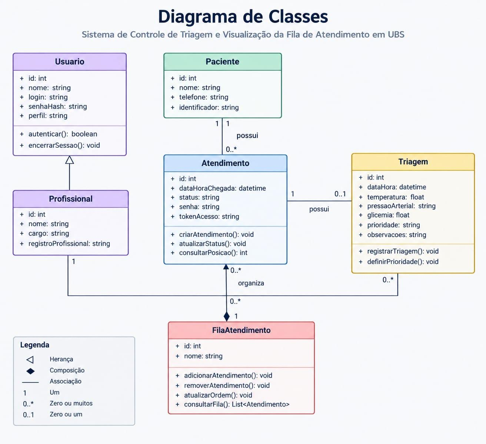
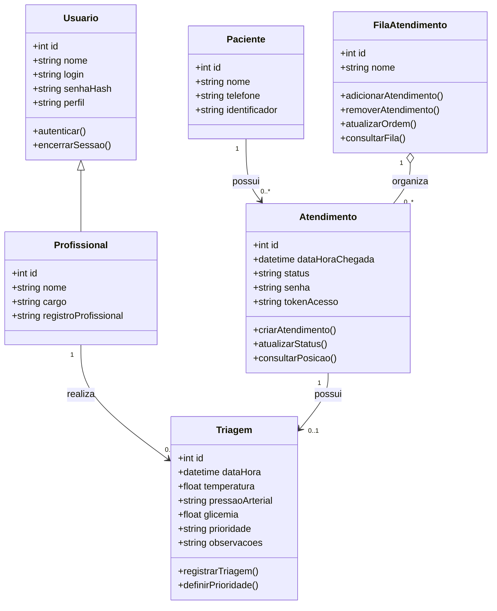
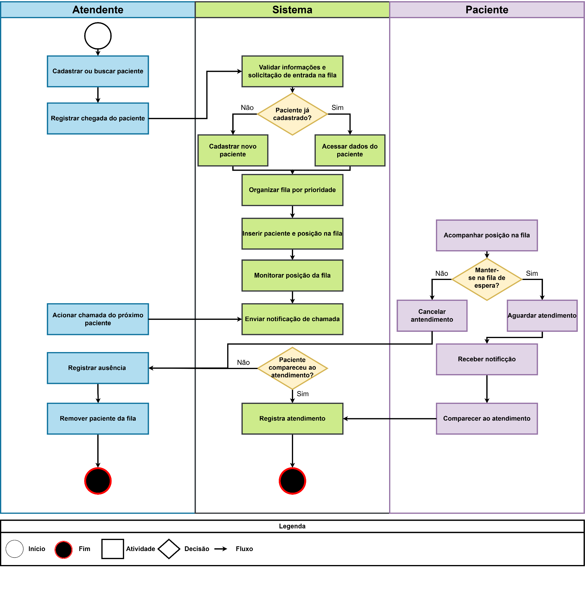

# 🏥 VezCerta — Sistema de Gestão e Acompanhamento de Filas (UBS)

> **Solução Web e Mobile para gerenciamento, organização e acompanhamento em tempo real das filas de atendimento da UBS Rosália Mota Almeida — Quixeramobim.**

[](https://github.com/talle5/trabalho_ES)
[](https://www.figma.com/proto/rKSutBgNt2mCGvUYm8cOHF/Prot%C3%B3tipo-de-Alta-Fidelidade---UBS)
[](./Documento%20de%20Especificação%20de%20Requisitos.pdf)

---

## 👥 Equipe do Projeto

- **Maria Eduarda Spinosa Braga Leandro**
- **Rian Cristhian Brito da Silva**
- **Talles André Lopes Lima**
- **Francisca Issllany de Sousa Braga**
- **João Luiz Bezerra das Chagas**

---

## 📌 Sumário

1. [Sobre o Projeto](#-sobre-o-projeto)
2. [Parte 2 — Figma, Modelos e Arquitetura de Software](#parte-2--figma-modelos-e-arquitetura-de-software)
   - [1. Telas do Sistema e Validação com o Cliente](#1-figma-telas-do-sistema-e-evidências-de-validação-com-o-cliente)
     - [1.1 Links dos Protótipos no Figma](#11-links-dos-protótipos-no-figma)
     - [1.2 Identidade Visual e Paleta de Cores](#12-identidade-visual-e-paleta-de-cores)
     - [1.3 Módulo Paciente (Mobile First / PWA)](#13-módulo-paciente-mobile-first--pwa)
     - [1.4 Módulo Recepção / Triagem (Web Desktop)](#14-módulo-recepção--triagem-web-desktop)
     - [1.5 Relatório de Evidências de Validação](#15-relatório-de-evidências-de-validação-com-o-cliente)
   - [2. Diagrama de Classes](#2-diagrama-de-classes)
     - [2.1 Representação Visual e Mermaid](#21-representação-do-diagrama-de-classes)
     - [2.2 Detalhamento das Classes e Métodos](#22-descrição-das-classes)
     - [2.3 Relacionamentos](#23-relacionamentos-entre-as-classes)
   - [3. Diagrama de Atividades](#3-diagrama-de-atividades)
     - [3.1 Fluxo em Raias (Swimlanes)](#31-fluxo-em-raias-swimlanes)
     - [3.2 Detalhamento Sequencial do Processo](#32-detalhamento-sequencial-do-processo)
   - [4. Arquitetura do Sistema e Stack Tecnológica](#4-arquitetura-do-sistema)
     - [4.1 Estilo Arquitetural](#41-visão-geral-e-estilo-arquitetural)
     - [4.2 Módulos do Sistema](#42-módulos-do-sistema)
     - [4.3 Stack Tecnológica Justificada](#43-tecnologias-utilizadas-stack-tecnológica-justificada)

---

## 💡 Sobre o Projeto

O **VezCerta** é um sistema desenvolvido para otimizar a experiência de atendimento nas Unidades Básicas de Saúde (UBS), tendo como contexto de aplicação a **UBS Rosália Mota Almeida em Quixeramobim**.

### Problema
Superlotação nas salas de espera, falta de clareza do paciente em relação à sua previsão de atendimento e sobrecarga de trabalho dos profissionais da recepção e triagem com perguntas constantes sobre o andamento da fila.

### Solução Proposta
Uma plataforma integrada composta por:
1. **Painel Web (Desktop) para Atendentes e Triagem**: registro de chegada, ordenação por prioridades legais e de triagem, controle de chamadas e monitoramento de ausências.
2. **Aplicativo Web/PWA (Mobile) para Pacientes**: acesso instantâneo via QR Code ou link, exibindo posição em tempo real, tempo estimado e notificações de chamada sem necessidade de permanência aglomerada na sala de espera.

---

# PARTE 2 — FIGMA, MODELOS E ARQUITETURA DE SOFTWARE

## 1. FIGMA, TELAS DO SISTEMA E EVIDÊNCIAS DE VALIDAÇÃO COM O CLIENTE

### 1.1 Links dos Protótipos no Figma

- 🖥️ **[Protótipo Web — Módulo Atendente / Recepção](https://www.figma.com/proto/rKSutBgNt2mCGvUYm8cOHF/Prot%C3%B3tipo-de-Alta-Fidelidade---UBS?node-id=122-277&p=f&t=Ioykrn16y7Bq6IQJ-1&scaling=min-zoom&content-scaling=fixed&page-id=112%3A241&starting-point-node-id=122%3A277)**
- 📱 **[Protótipo Mobile — Módulo Paciente](https://www.figma.com/proto/rKSutBgNt2mCGvUYm8cOHF/Prot%C3%B3tipo-de-Alta-Fidelidade---UBS?node-id=1-3&p=f&t=vvrlcQXM4hmnSqL1-1&scaling=scale-down&content-scaling=fixed&page-id=0%3A1&starting-point-node-id=1%3A3)**

---

### 1.2 Identidade Visual e Paleta de Cores

As interfaces foram projetadas seguindo princípios de acessibilidade, contraste adequado para o ambiente de saúde pública e clareza nas ações:

| Amostra | Código Hex | Nome / Função | Descrição e Aplicação |
| :---: | :---: | :--- | :--- |
|  | `#004F9F` | **Azul Principal** | Cabeçalho, destaque da posição do usuário e barra inferior de navegação. |
|  | `#181E2B` | **Azul Escuro / Grafite** | Tipografia principal, títulos e elementos de alto contraste textual. |
|  | `#FA5056` | **Vermelho / Coral** | Ações destrutivas, alertas e botão de desistência da fila. |
|  | `#F2F6FC` | **Azul Muito Claro** | Plano de fundo das páginas para conforto visual. |
|  | `#FFF1F2` | **Rosa Claro** | Preenchimento secundário do botão e modais de cancelamento. |

---

### 1.3 Módulo Paciente (Mobile First / PWA)

Projetado para ser acessado diretamente pelo smartphone do paciente sem necessidade de download em lojas de aplicativo:

#### 1. Tela de Login e Cadastro
Interface inicial de autenticação simplificada, permitindo o ingresso com credenciais ou novo registro e redirecionamento direto para o painel de atendimento.

<p align="center">
  
  
  
</p>

#### 2. Tela de Fila de Espera
- Cabeçalho em tom azul com marca da aplicação e guias dos atendimentos ativos.
- Listagem central com **Posição** e **Nome**, destacando o usuário com tag azul **"Você"**.
- Botão inferior destacado em vermelho para desistência/cancelamento voluntário da consulta com confirmação.
- Barra de navegação inferior permanente:
  - **Esquerda**: Unidades de Saúde (localização).
  - **Centro**: Fila de Atendimento (seção ativa).
  - **Direita**: Perfil do Usuário.

<p align="center">
  
  
  
</p>

#### 3. Fluxo de Cancelamento de Atendimento
Permite ao paciente liberar sua vaga na fila com aviso prévio de confirmação e feedback imediato de conclusão do cancelamento:

<p align="center">
  
  
  
</p>

#### 4. Unidades de Saúde, Perfil e Histórico
- **Unidades de Saúde**: exibe dados geográficos e endereço da UBS vinculada.
- **Perfil do Paciente**: dados cadastrais e opções da conta.
- **Histórico de Atendimentos**: consultas anteriores e status de encerramento de cada chamada.

<p align="center">
  
  
  
</p>

---

### 1.4 Módulo Recepção / Triagem (Web Desktop)

Interface otimizada para computadores da recepção da UBS, priorizando velocidade de operação e visão simultânea das filas:

<p align="center">
  
</p>

1. **Tela de Login**:
   - Autenticação restrita de atendentes com e-mail e senha.
2. **Tela de Fila (Acompanhamento por Médico)**:
   - **Menu Lateral**: atalhos para *Fila*, *Consultas*, *Solicitações de saída* e *Meu perfil*.
   - **Cabeçalho**: saudação, data atual e identificação da unidade (*UBS CENTRO*).
   - **Barra de Busca**: pesquisa rápida por médico ou paciente.
   - **Abas Superiores por Especialidade**: alternância entre profissionais (ex.: Dr. Ricardo Mendes - Clínico Geral, Dra. Luiza Freitas - Dentista).
   - **Tabela de Atendimento**: Posição (1º, 2º), Nome do Paciente e botão de ação *"Remover paciente"* para gerenciar desistências.
3. **Tela de Consultas**:
   - Navegação com breadcrumbs (`> Consultas`).
   - Botão em destaque *"Cadastrar nova consulta"*.
   - Filtro de consultas do dia por profissional e listagem com Nome Completo e CPF.
4. **Tela de Solicitações de Saída**:
   - Indicador com contador de pendências no menu lateral.
   - Cartões com paciente, horário da solicitação e botão *"Aceitar Solicitação"*.
5. **Tela de Meu Perfil**:
   - Dados cadastrais do atendente (nome, matrícula `ATD-0042`, função e unidade).

---

### 1.5 Relatório de Evidências de Validação com o Cliente

- **Cliente / Validadora**: Eliane Brito (Técnica de Enfermagem).
- **Método Utilizado**: Chamada de vídeo no Google Meet com demonstração interativa e navegação pelos fluxos do protótipo.

| Item Testado | Feedback do Cliente | Ação / Ajuste Realizado |
| :--- | :--- | :--- |
| **Protótipo Web (Recepção)** | Aprovou a interface, organização visual das telas e fluxo ágil de navegação. | Mantido conforme apresentado. |
| **Funcionalidades do Protótipo Web** | Considerou que o conjunto de recursos atende com precisão às rotinas diárias da recepção da UBS. | Funcionalidades aprovadas e mantidas. |
| **Protótipo Mobile (Paciente)** | Aprovou a facilidade de acompanhamento e simplicidade da interface mobile. | Mantido conforme apresentado. |
| **Validação Geral** | Aprovou a solução global sem necessidade de alterações estruturais nesta etapa. | Protótipo homologado para a fase de desenvolvimento. |

---

## 2. DIAGRAMA DE CLASSES

### 2.1 Representação do Diagrama de Classes

O diagrama de classes modela a estrutura de dados e as operações do domínio de triagem e controle de filas da UBS:

<p align="center">
  
</p>



---

### 2.2 Descrição das Classes

1. **`Usuario`**:
   - Representa os operadores com acesso ao sistema administrativo.
   - Atributos: `id`, `nome`, `login`, `senhaHash`, `perfil`.
   - Métodos: `autenticar()`, `encerrarSessao()`.
2. **`Profissional`**:
   - Especialização de `Usuario`, representando atendentes, enfermeiros e médicos da UBS.
   - Atributos adicionais: `cargo`, `registroProfissional`.
3. **`Paciente`**:
   - Representa os cidadãos atendidos pela unidade.
   - Atributos: `id`, `nome`, `telefone`, `identificador` (CNS/CPF).
4. **`Atendimento`**:
   - Registra o ciclo de uma visita do paciente à unidade.
   - Atributos: `id`, `dataHoraChegada`, `status` (*Aguardando* → *Em atendimento* → *Finalizado*), `senha`, `tokenAcesso`.
   - Métodos: `criarAtendimento()`, `atualizarStatus()`, `consultarPosicao()`.
   - *Nota*: `tokenAcesso` gera a chave única para consulta via QR Code/PWA móvel.
5. **`Triagem`**:
   - Dados clínicos preliminares coletados antes da consulta médica.
   - Atributos: `id`, `dataHora`, `temperatura`, `pressaoArterial`, `glicemia`, `prioridade`, `observacoes`.
   - Métodos: `registrarTriagem()`, `definirPrioridade()`.
6. **`FilaAtendimento`**:
   - Gerencia a ordenação e sequência dos atendimentos ativos.
   - Atributos: `id`, `nome`.
   - Métodos: `adicionarAtendimento()`, `removerAtendimento()`, `atualizarOrdem()`, `consultarFila()`.

---

### 2.3 Relacionamentos entre as Classes

- **`Paciente 1 → 0..* Atendimento`**: um paciente pode possuir múltiplos atendimentos ao longo do tempo.
- **`Atendimento 1 → 0..1 Triagem`**: cada atendimento possui no máximo uma avaliação de triagem associada.
- **`Profissional 1 → 0..* Triagem`**: um profissional pode realizar a triagem de múltiplos pacientes.
- **`FilaAtendimento 1 o-- 0..* Atendimento`**: agregação onde a fila organiza dinamicamente diversos atendimentos.
- **`Usuario <|-- Profissional`**: herança direta para reaproveitamento de credenciais e permissões.

---

## 3. DIAGRAMA DE ATIVIDADES

O Diagrama de Atividades modela a interação dinâmica entre os três atores principais durante o ciclo de vida do atendimento:

<p align="center">
  
</p>

### 3.1 Fluxo em Raias (Swimlanes)

1. **Atendente (Módulo Web)**: ações executadas pela equipe da recepção da UBS.
2. **Sistema VezCerta (Backend & Tempo Real)**: validações, ordenação de prioridades e emissão de eventos.
3. **Paciente (Aplicativo PWA / Mobile)**: visualização remota, desistência voluntária e comparecimento.

---

### 3.2 Detalhamento Sequencial do Processo

1. **Recepção e Entrada**:
   - O atendente busca ou cadastra o paciente e registra sua chegada na UBS.
2. **Processamento da Fila**:
   - O sistema valida as informações cadastrais e calcula a prioridade (legal ou de triagem).
   - O paciente é posicionado na fila e passa a ser monitorado em tempo real.
3. **Acompanhamento do Paciente**:
   - O paciente visualiza sua posição pelo smartphone.
   - Possui autonomia para aguardar ou acionar o cancelamento voluntário caso desista da consulta.
4. **Chamada do Paciente**:
   - A recepção ou consultório aciona *"Chamar próximo"*.
   - O sistema emite notificação instantânea (WebSocket) para o celular do paciente.
5. **Desfecho do Atendimento**:
   - **Se o paciente comparece**: o atendimento é registrado e concluído com sucesso.
   - **Se o paciente não comparece (No-show)**: a ausência é registrada e o paciente é removido da fila.

---

## 4. ARQUITETURA DO SISTEMA

### 4.1 Visão Geral e Estilo Arquitetural

A aplicação segue o padrão **Cliente-Servidor em Três Camadas**:

```text
┌─────────────────────────────────────────────────────────────┐
│                      CAMADA DE FRONT-END                    │
│   [ Módulo Paciente - PWA ]     [ Módulo Recepção - Web ]   │
│       (React + Tailwind)            (React + Tailwind)      │
└──────────────────────────────┬──────────────────────────────┘
                               │ HTTPS / WSS (WebSocket)
                               ▼
┌─────────────────────────────────────────────────────────────┐
│                      CAMADA DE BACK-END                     │
│               [ Node.js + TypeScript + Express ]             │
│        • JWT Auth       • Engine de Fila e Prioridades      │
│        • Socket.io      • Cálculo de Estimativa de Espera   │
└──────────────────────────────┬──────────────────────────────┘
                               │ Prisma ORM
                               ▼
┌─────────────────────────────────────────────────────────────┐
│                    CAMADA DE PERSISTÊNCIA                   │
│                     [ PostgreSQL Database ]                 │
└─────────────────────────────────────────────────────────────┘
```

---

### 4.2 Módulos do Sistema

1. **Módulo de Autenticação e Usuários**:
   - Autenticação via JSON Web Tokens (JWT) para operadores da recepção.
   - Controle de permissões para operações críticas (chamar, remover e reordenar).
2. **Módulo de Gestão da Fila**:
   - Algoritmo de intercalação entre fila convencional e prioridades (idosos, gestantes, PCDs).
   - Gestão de status do consultório (*Ativo*, *Em Pausa*).
3. **Módulo de Estimativa de Tempo de Espera**:
   - Cálculo baseado na posição na fila multiplicada pelo histórico médio de tempo de atendimento do médico.
   - Pausa automática da contagem quando o consultório estiver em intervalo.
4. **Módulo de Notificações em Tempo Real**:
   - Comunicação bidirecional via WebSockets (`Socket.io`).
   - Atualização do painel mobile em menos de 2 segundos a cada mudança na fila.

---

### 4.3 Tecnologias Utilizadas (Stack Tecnológica Justificada)

| Camada | Tecnologia | Justificativa Técnica |
| :--- | :--- | :--- |
| **Interface Paciente (Celular)** | **React (PWA) + Tailwind CSS** | Leve e responsivo. Por ser PWA/Web, o paciente não precisa instalar aplicativo da loja nem ocupar memória do smartphone — basta ler o QR Code ou acessar o link. O Tailwind garante alta legibilidade e contraste. |
| **Interface Recepção (Desktop)** | **React + Tailwind CSS** | Interface desktop moderna, ágil e com controle simultâneo de múltiplos consultórios em um único painel. |
| **Back-end (API)** | **Node.js (Express / NestJS) + TypeScript** | Alto desempenho em requisições assíncronas e I/O intensivo. A tipagem estrita do TypeScript reduz bugs no manuseio de dados dos pacientes e ordens de fila. |
| **Comunicação em Tempo Real** | **Socket.io (WebSockets)** | Atualiza o smartphone do paciente instantaneamente assim que a fila anda, eliminando a necessidade de recarregar a página (F5). |
| **Banco de Dados** | **PostgreSQL** | SGBD relacional robusto, confiável e compatível com transações ACID essenciais para consistência de filas e histórico médico. |
| **ORM** | **Prisma ORM** | Mapeamento objeto-relacional tipado de ponta a ponta, agilizando queries seguras e migrações do banco. |

---

## 📂 Estrutura de Diretórios do Repositório

```bash
trabalho_ES/
├── Documento de Especificação de Requisitos.pdf # Documentação completa (v1.0)
├── Protótipo de Alta Fidelidade - UBS/          # Exportações das telas do Figma
├── docs/
│   └── diagramas/
│       ├── diagrama_de_classes.png              # Diagrama de Classes
│       └── diagrama_de_atividades.png           # Diagrama de Atividades
└── README.md                                    # Documentação principal
```
